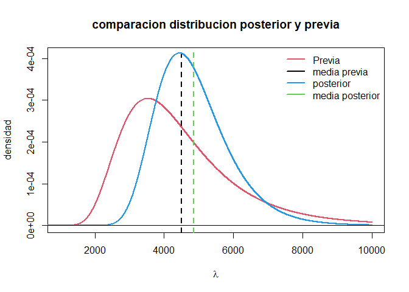

## Caso de estudio

Un investigador del Departamento de Ingeniería Electrónica y Eléctrica
de una universidad necesita analizar unos datos sobre los tiempos de
falla de un determinado tipo de alambre (Tipo 1). En este problema, el
tiempo de falla se define como el número de veces que una máquina podría
tensionar el alambre antes de romperse. Los siguientes datos
corresponden a $ n= 14$ tiempos de falla de una parte del experimento:
495  541  1461  1555  1603  2201  2750  3468  3516  4319  6622  7728  13159  21194
A partir de este contexto, Su incertidumbre acerca de estos datos antes
de que fueran observados es intercambiable. Por lo tanto, resulta
apropiado modelar los datos como condicionalmente independientes e
idénticamente distribuidos. El modelo más simple para los datos del
tiempo de falla involucra la distribución Exponencial:

## Pregunta 1 estadístico suficiente

Muestre que $s=\\sum\_{i=1}^n y_i$ es un estadístico suficiente para
*λ*.

### Solución:

Aplicando el criterio de factorización de Fisher-Neyman se observa que:
$$
\\begin{split}
\\mathcal{L}(\\lambda\|y_1,...,y_n)&=\\prod\_{i=1}^{n}\\frac{1}{\\lambda}e^{-\\frac{y_i}{\\lambda}}I\_{(0,\\infty)}(y_i)\\\\
&=\\underbrace{\\frac{1}{\\lambda^n}e^{-\\frac{\\sum\_{i=1}^ny_i}{\\lambda}}}\_{g(T(y),\\lambda)}\\overbrace{\\prod\_{i=1}^{n}I\_{(0,\\infty)}(y_i)}^{h(y)} \\\\
\\end{split}
$$
Con esto, vemos que un estadístico suficiente es $s=\\sum\_{i=1}^ny_i$
dado que este estadístico cumple al poderse factorizar de la expresión
de verosimilitud en una función g que solo depende del estadístico
suficiente y el parámetro.

## Pregunta 2 Gamma inversa

Se dice que la variable aleatoria *X* tiene distribución Gamma-Inversa
con parámetros *α* \> 0 y *β* \> 0, si la función de densidad de *X*
está dada por:
$$
    X \\sim \\textsf{GI} ( \\alpha, \\beta )\\text{,} \\ \\ \\ \\textrm{i.e.,} \\ \\ \\ 
    p ( x ) = \\frac{ \\beta^\\alpha }{ \\Gamma ( \\alpha ) } x^{ - ( \\alpha + 1 ) } \\exp{ \\left( - \\frac{ \\beta }{ x } \\right) } \\quad\\text{para $x>0$}.
    $$
Muestre que si *X* ∼ Gamma(*α*,*β*), entonces
$\\frac{1}{X}\\sim \\textsf{GI} ( \\alpha, \\beta )$.

### solución:

Siendo *X* una V.a absolutamente continua, se usa el teorema de la
transformación para determinar la distribución de
$Y=\\frac{1}{X} \\ con \\ X>0$ a partir de la distribución conocida *X*
$$
P\\left( \\frac{1}{X}\\right) =f_X\\left( \\frac{1}{Y}\\right) \\left\| \\frac{\\delta X}{\\delta Y} \\right\|= \\frac{\\beta^{\\alpha}}{\\Gamma(\\alpha)}\\left(\\frac{1}{Y} \\right)^{\\alpha -1}exp\\left( -\\frac{\\beta}{Y} \\right) \\left\| -\\frac{1}{Y^2} \\right\|
$$
Resolviendo como se indica a continuación
$$
\\begin{split}
P\\left( \\frac{1}{X}\\right) &=\\frac{\\beta^{\\alpha}}{\\Gamma(\\alpha)}\\left(\\frac{1}{Y} \\right)^{\\alpha -1}exp\\left( -\\frac{\\beta}{Y} \\right) \\left( \\frac{1}{Y^2} \\right)\\\\
&=\\frac{\\beta^{\\alpha}}{\\Gamma(\\alpha)}\\left(\\frac{1}{Y} \\right)^{\\alpha +1}exp\\left( -\\frac{\\beta}{Y} \\right) \\\\
P\\left( \\frac{1}{X}\\right)=P\\left( Y \\right)&=\\frac{\\beta^{\\alpha}}{\\Gamma(\\alpha)}Y^{-(\\alpha +1)}exp\\left( -\\frac{\\beta}{Y} \\right) \\sim GI(\\alpha,\\beta)
\\end{split}
$$
Dado que lo obtenido al aplicar el teorema de transformación fue la
distribución descrita como Gamma inversa (*G**I*) con los respectivos
parámetros, podemos asegurar que la afirmación propuesta en el punto
resulta verdadera.

## Punto 3 Posterior conjugada

Considere la distribución previa *λ* ∼ GI(*α*,*β*) junto con la
distribución muestral . Halle la distribución posterior de *λ*.

### solución:

Para esto se emplea el teorema de bayes para encontrar la distribución
posterior de *λ* a partir de la distribución muestral y la distribución
previa.

$$
\\begin{split}
p(\\lambda \| \\vec{y}) &\\propto p(\\vec{y}\|\\lambda)p(\\lambda)\\\\
&\\propto \\left\[ \\prod\_{i=1}^n \\frac{1}{\\lambda}exp \\left( \\frac{-y_i}{\\lambda} \\right) \\right\] \\frac{\\beta^\\alpha}{\\Gamma(\\alpha)}\\lambda^{-(\\alpha+1)}exp\\left( -\\frac{\\beta}{\\lambda} \\right)\\\\
&\\propto \\lambda^{-n}exp\\left( \\frac{-1}{\\lambda}\\sum\_{i=1}^ny_i \\right)\\lambda^{-(\\alpha+1)}exp\\left( \\frac{-\\beta}{\\lambda} \\right)\\\\
p(\\lambda\|\\vec{y})&\\propto \\lambda^{-(\\alpha +n +1)}exp\\left( \\frac{-(\\beta + s)}{\\lambda} \\right) \\sim GI(\\alpha +n,\\beta+s)
\\end{split}
$$

## Punto 4 Información externa

Se tiene información externa de otro experimento de acuerdo con el cual
la distribución previa de *λ* debería tener una media
*μ*0 = 4500 y una desviación estándar *σ*0 = 1800.
Haga un gráfico de las distribuciones previa y posterior en el mismo
gráfico.

### solución:

Lo primero es encontrar los hiperparametros de la distribución previa,
tal que satisfaga la media *μ*0 = 4500 y la desviación
estándar *σ*0 = 1800, dando el siguiente sistema de
ecuaciones:
$$
\\begin{split}
4500&=\\frac{\\beta_0}{\\alpha_0-1}\\ \\ \\ \\ \\ \\ \\ para \\ \\alpha_0 >1\\\\
1800&=\\sqrt{\\frac{\\beta_0^2}{(\\alpha_0-1)^2(\\alpha_0-2)}} \\ \\ \\ \\ \\ \\ \\ para \\ \\alpha_0\>2
\\end{split}
$$

Resolviendo el sistema de ecuaciones, tenemos que *α*0 = 8.25
y *β*0 = 32625. con esto ya se puede construir la
distribución previa.

Ahora, en base al punto anterior, donde se calculó la distribución
posterior para este modelo, la cual tiene la forma
*G**I*(*α*+*n*,*β*+*s*); donde *n* es el tamaño de la muestra y *s* es
la suma de todos los *y**i*. Empleando una suma sobre los 14
términos observados en los datos, resulta que *n* = 14 y *s* = 70612.

Ahora sigue construir y graficar ambas distribuciones. Tanto la previa
como la posterior, usando código en R para realizar dicha acción, el
resultado es el siguiente:

## Punto 5 MLE

Halle el estimador de máxima verosimilitud (MLE, por sus siglas en
inglés) de *λ*.

### solución:

Para encontrar el estimador de máxima verosimilitud, lo primero es
calcular la función de verosimilitud del parámetro dada la muestra y
encontrar el máximo global de dicha función. Pero antes, se usará la
parametrización de la exponencial donde $\\theta=\\frac{1}{\\lambda}$,
luego de encontrar el MLE para dicho parámetro, se emplea la invarianza
funcional del estimador MLE para encontrar el estimador MLE de *λ*.

Se empieza encontrando la función de verosimilitud del parámetro *θ* de
la siguiente manera
$$
\\begin{split}
\\mathcal{L}(\\theta\|\\vec{y})&=\\prod\_{i=1}^np(y_i\|\\theta)\\\\
&=\\prod\_{i=1}^n\\theta e^{-\\theta y_i}\\\\
&=\\theta^ne^{-\\theta\\sum\_{i=1}^ny_i}
\\end{split}
$$
Para simplificar la notación y también las matemáticas en los siguientes
pasos, se usa como convención que $s=\\sum\_{i=1}^n y_i$ . Además, en el
proceso de maximización se emplea la función log-verosimilitud
𝓁(*θ*\|*y⃗*), la cual es el logaritmo natural de la anteriormente
encontrada.

Siguiendo con la maximización de la función, primero se encuentran los
puntos críticos empleando la primera derivada
$$
\\begin{split}
\\frac{\\delta}{\\delta\\theta}l(\\theta\|\\vec{y})&=\\frac{\\delta}{\\delta \\theta}\\left( n\*ln(\\theta)-\\theta s \\right)\\\\
&=\\frac{n}{\\theta}-s\\\\
0&=\\frac{n}{\\hat{\\theta}}-s\\\\
\\hat{\\theta}&=\\frac{n}{s}
\\end{split}
$$
para evaluar el punto crítico encontrado se aplica el criterio de la
segunda derivada. En él, tenemos como criterio especial que si la
función es siempre negativa en todo el soporte, el punto encontrado es
un máximo global.
$$
\\frac{\\delta}{\\delta \\theta}(\\frac{n}{\\theta}-s)=-\\frac{n}{\\theta^2}
$$
Se tiene que la función obtenida es siempre negativa ya que *n* \> 0 al
igual que *θ*2 \> 0. Por lo tanto, el punto crítico
encontrado no solo es un máximo local, sino también un máximo global. Se
tiene, entonces, que $\\hat{\\theta}\_{MLE}=\\frac{n}{s}$.

Ahora trabajamos con la invarianza funcional del estimador MLE para
encontrar el estimador de máxima verosimilitud de
$\\lambda =\\frac{1}{\\theta}$. Tenemos, entonces, que:
$$
\\begin{split}
\\hat{g(\\theta)}\_{MLE}&=g(\\hat{\\theta}\_{MLE})\\\\
\\hat{\\lambda}\_{MLE}&=\\frac{1}{\\hat{\\theta}\_{MLE}}=\\frac{1}{\\frac{n}{s}}\\\\
\\hat{\\lambda}\_{MLE}&=\\frac{s}{n}
\\end{split}
$$

## Punto 6 Comparación métodos

Complete la siguiente tabla:
Para completar la Tabla 1 tenga en cuenta que:
### solución:

#### Enfoque Bayesiano

Para completar la fila mediante el método bayesiano, se parte de la
distribución posterior encontrada anteriormente *G**I*(22.25,104237).
Donde, para crear una estimación puntual del parámetro, se hace uso de
la media de la distribución posterior
$\\mu_p=\\frac{\\beta}{\\alpha -1}$. Para el coeficiente de variación se
tiene que $CV\\%=\\frac{\\sigma}{\\mu}\*100$ donde *σ* es la desviación
estándar de la distribución posterior y *μ* la media de la misma.

Para el intervalo, que en el panorama estadístico se denomina región de
confianza, se plantea un (*l*,*u*) tal que
*p*(*l*\<*λ*\<*u*\|*y⃗*) = 0.95. Así, para encontrar los límites del
intervalo, se emplean los cuantiles de la distribución posterior, tal
que *l* = *λ*0.025 y *u* = *λ*0.975, de forma tal
que se encierre la probabilidad pedida.

Realizando estos cálculos, empleando R, se llega a los siguientes
resultados:
#### Enfoque frecuentista asintótico

Para la parte frecuentista asintótica, se parte de la base que
*λ̂*MLE ≈ N(*λ*,*Î*−1). Para la estimación puntual
esto no afecta ya que se emplea el estimador encontrado en el punto 5,
que es igual a la media muestral.

Para el CV se plantea primero, gracias a la librería mle.tools,
encontrar la información observada de Fisher para el parámetro lambda,
una vez realizado esto, se tiene que
$CV\\%=\\frac{\\sqrt{\\frac{1}{I_n}}}{\\hat{\\lambda}\_{MLE}}\*100$.

Por último, en el intervalo de confianza, ya que se tiene la
distribución asintótica, se plantea la variable pivote de forma tal que
$Q(\\vec{y},\\lambda)=\\sqrt{I_n}(\\hat{\\lambda}\_{MLE}-\\lambda)\\approx N(0,1)$.
De la ecuación presentada se despeja *λ* y se acotan los intervalos de
la siguiente manera:
$$
\\begin{split}
p\\left( z\_{0.025}\< \\sqrt{I_n}(\\hat{\\lambda}\_{MLE}-\\lambda)\<z\_{0.975} \\right)&=0.95\\\\
p\\left( -\\frac{z\_{0.975}}{\\sqrt{I_n}}+\\hat{\\lambda}\_{MLE}\<\\lambda\<-\\frac{z\_{0.025}}{\\sqrt{I_n}}+\\hat{\\lambda}\_{MLE} \\right)&=0.95
\\end{split}
$$
Ya con este intervalo y el código en r, se calculan las fronteras de
este, llegando al resultado.

A continuación, se muestra la lista de los datos pedidos
#### Enfoque frecuentista boostrap

En este, se generan varios remuestreos con remplazo, del mismo tamaño de
los datos. Esto con el fin de generar un vector de tamaño 10000 con
10000 muestras creadas a partir de muestras aleatoreas de los datos;
asumiendo que la muestra original es representativa.

Lo que se hace con este vector es sacarle la media a cada conjunto de
datos creado, esto debido a que en el paradigma frecuentista, el
estimador MLE para el parámetro era la media muestral, de esta manera se
obtiene un vector de medias de tamaño 10000, uno por cada muestra
generada mediante boostrap, a partir del cual podemos aproximar la
distribución del estadístico.

Para los datos pedidos en la tabla, se hace inferencia usando las
características empíricas de ese vector de medias. La estimación puntual
del parámetro seria la media del vector de medias, para el CV, se toma
éste últico junto con la varianza del vector de medias. Con la varianza
empírica del vector, obtenemos la desviación estándar empírica y
siguiendo la formula
$CV\\%=\\frac{\\sigma\_{empirica}}{\\mu\_{empirico}}\*100$ se calcula el
CV.

Para el intervalo de confianza, se manejan los cuantiles del vector de
medias, esto debido a que estamos usando este mismo como una
aproximación de la distribución del verdadero parámetro. Los cuantiles
tomados tal que satisfagan los requerimientos de confianza pedidos son
el 0.025 y 0.975.

A continuación, se presenta los valores calculados por este método:
La tabla completa se puede ver a continuación
## Punto 7 posterior y posterior predictiva

Calcule e interprete Pr(*λ*\<4000∣**y**) y
Pr(*y*\*\<4000∣**y**), donde *y*\* es un tiempo de
falla futuro.

### solución:

El primero resulta ser la probabilidad de que lambda sea menor a 4000,
una vez se observaron los datos. Esto se cuantifica con la distribución
posterior de lambda. Para su cálculo se empleó la librería invgamma,
donde se encuentra la función pinvgamma;con la cual se calcula la
probabilidad acumulada hasta cierto valor; a esta función se le entrega
la distribución posterior encontrada en los incisos anteriores.

La segunda probabilidad pedida es predicción sobre un nuevo valor. Esta
quiere decir cuál es la probabilidad de que un dato no observado (que no
es parte de la muestra) sea menor a 4000. Como se puede notar, ambas son
cantidades distintas; hacen inferencia sobre entidades distintas. La
distribución posterior hace inferencia sobre el parámetro. En cambio, la
función predictiva posterior hace inferencia sobre el valor que puede
tomar una unidad no observada, es decir, la probabilidad de que el
tiempo de falla de un nuevo alambre sea menor a 4000.

Para calcular la probabilidad acumulada para una nueva observació,
primero hay que calcular la distribución predictiva posterior. Para eso,
se usa la siguiente ecuación:
$$
\\begin{split}
p(y^\*\|\\vec{y})&=\\int\_{\\Theta}p(y^\*\|\\lambda)p(\\lambda\|\\vec{y})d\\lambda\\\\
&=\\int\_{\\Theta}\\frac{1}{\\lambda}e^{-\\frac{y^\*}{\\lambda}}\\frac{(\\beta+s)^{\\alpha+n}}{\\Gamma(\\alpha+n)}\\lambda^{-(\\alpha +n +1)}exp\\left( \\frac{-(\\beta + s)}{\\lambda} \\right)d\\lambda\\\\
&=\\frac{(\\beta+s)^{\\alpha+n}}{\\Gamma(\\alpha+n)}\\int\_{\\Theta}\\lambda^{-(\\alpha+n+1+1)}e^{\\left( \\frac{-(\\beta + s+y^\*)}{\\lambda} \\right)}d\\lambda\\\\
&=\\frac{(\\beta+s)^{\\alpha+n}}{\\Gamma(\\alpha+n)}\\frac{\\Gamma(\\alpha+n+1)}{(\\beta+s+y^\*)^{(\\alpha+n+1)}}\\\\
&=\\frac{(\\beta+s)^{(\\alpha+n)}(\\alpha+n)\\Gamma(\\alpha+n)}{\\Gamma(\\alpha+n)(\\beta+s+y^\*)^{(\\alpha+n)}(\\beta+s+y^\*)}\\\\
p(y^\*\|\\vec{y})&=\\left(\\frac{\\beta+s}{\\beta+s+y^\*}\\right)^{\\alpha+n}\\frac{\\alpha+n}{\\beta+s+y^\*}
\\end{split}
$$
Ya con la función de densidad de la predictiva posterior, se calcula
Pr(*y*\*\<4000∣**y**), aplicando la integral sobre esta desde
0 hasta 4000, ya que los valores que puede tomar la variable son los
positivos, dada la definición de la misma. Esta integral se observa a
continuación.
$$
\\begin{split}
\\textsf{Pr}(y^\* \< 4000\\mid\\boldsymbol{y})&=\\int_0^{4000}\\left(\\frac{\\beta+s}{\\beta+s+y^\*}\\right)^{\\alpha+n}\\frac{\\alpha+n}{\\beta+s+y^\*}dy^\*\\\\
&=(\\beta+s)^{\\alpha+n}(\\alpha+n)\\int_0^{4000}\\frac{1}{(\\beta+s+y^\*)^{\\alpha+n+1}}dy^\*\\\\
&=103237^{22.25}22.25\\int_0^{4000}\\frac{1}{(103237+y^\*)^{23.25}}dy^\*\\\\
&=103237^{22.25}22.25\\int\_{103237}^{107237}u^{-23.25}du\\\\
&=103237^{22.25}22.25\\left( \\frac{-1}{22.25(107237)^{22.25}}+\\frac{1}{22.25(103237)^{22.25}} \\right)\\\\
&=-\\left(  \\frac{103237}{107237} \\right)^{22.25}+1\\\\
\\textsf{Pr}(y^\* \< 4000\\mid\\boldsymbol{y})&=0.5708
\\end{split}
$$
Empleando código de r, se obtuvo que Pr(*λ*\<4000∣**y**) = 0.2155. Como
se mencionaba anteriormente, ambas cantidades no son iguales porque son
inferencias sobre objetos distintos. Estos resultados reafirman lo
previamente mencionado.

## Punto 8 prueba de hipótesis valor del parámetro

Pruebe el sistema de hipótesis *H*0 : *λ* = *λ*0
frente a *H*1 : *λ* ≠ *λ*0, con
*λ*0 = 4000. Para ello tenga en cuenta que
$$
    p(\\boldsymbol{y}\\mid H_0) = \\int\_{0}^\\infty \\lambda_0^{-n}\\exp{\\left(-\\tfrac{1}{\\lambda_0}\\textstyle\\sum\_{i=1}^n y_i\\right)}\\,\\delta\_{\\lambda_0}(\\lambda)\\,\\text{d}\\lambda
    $$
y
$$
    p(\\boldsymbol{y}\\mid H_1) = \\int\_{0}^\\infty \\lambda^{-n}\\exp{\\left(-\\tfrac{1}{\\lambda}\\textstyle\\sum\_{i=1}^n y_i\\right)}\\,\\frac{\\beta_0^{\\alpha_0}}{\\Gamma(\\alpha_0)}\\lambda^{-(\\alpha_0+1)}\\exp{\\left(-\\frac{\\beta_0}{\\lambda}\\right)}\\,\\text{d}\\lambda
    $$
donde *δ**a*(*x*) es la función delta de Dirac. Reporte el
factor de Bayes *B*10 e interprete los resultados.

### solución:

El factor de bayes es una cantidad empleada para evaluar un sistema de
hipótesis. En este caso, el sistema que se planea evaluar es
*H*0 : *λ* = 4000 y *H*1 : *λ* ≠ 4000, para esto
se calcula el factor de bayes10 de la siguiente manera:

$$
\\begin{split}
B\_{10}=\\frac{Pr(\\vec{y}\|H_1)}{Pr(\\vec{y}\|H_0)}&=\\frac{\\int\_{0}^\\infty \\lambda^{-n}\\exp{\\left(-\\tfrac{1}{\\lambda}\\textstyle\\sum\_{i=1}^n y_i\\right)}\\,\\frac{\\beta_0^{\\alpha_0}}{\\Gamma(\\alpha_0)}\\lambda^{-(\\alpha_0+1)}\\exp{\\left(-\\frac{\\beta_0}{\\lambda}\\right)}\\,\\text{d}\\lambda}{\\int\_{0}^\\infty \\lambda_0^{-n}\\exp{\\left(-\\tfrac{1}{\\lambda_0}\\textstyle\\sum\_{i=1}^n y_i\\right)}\\,\\delta\_{\\lambda_0}(\\lambda)\\,\\text{d}\\lambda}\\\\
&=\\frac{\\frac{\\beta_0^{\\alpha_0}}{\\Gamma(\\alpha_0)}\\int\_{0}^\\infty\\lambda^{-(\\alpha+n+1)}\\exp{\\left(-\\tfrac{\\beta_0+\\textstyle\\sum\_{i=1}^ny_i}{\\lambda}\\right)\\text{d}\\lambda}}{\\lambda_0^{-n}\\exp{\\left(-\\tfrac{1}{\\lambda_0}\\textstyle\\sum\_{i=1}^n y_i\\right)}\\int\_{0}^\\infty\\delta\_{\\lambda_0}(\\lambda)\\text{d}\\lambda}\\\\
&=\\frac{\\frac{\\beta_0^{\\alpha_0}}{\\Gamma(\\alpha_0)}\\frac{\\Gamma(\\alpha_0+n)}{(\\beta_0+s)^{\\alpha_0+n}}}{\\lambda_0^{-n}\\exp{\\left(-\\tfrac{s}{\\lambda_0}\\right)}}
\\end{split}
$$
Remplazando por *β*0 = 32625, *α*0 = 8.25,
*s* = 70612, *n* = 14 y *λ*0 = 4000 se tiene la siguiente
ecuación:
$$
\\begin{split}
B\_{10}&=\\frac{\\left(\\frac{32625}{103237}\\right)^{8.25}\\frac{\\Gamma(22.25)}{\\Gamma(8.25)(103237)^{14}}}{4000^{-14}e^{-17.653}}\\\\
&=\\left(\\frac{32625}{103237}\\right)^{8.25}\\left(\\frac{4000}{103237}\\right)^{14}\\frac{\\Gamma(22.25)e^{17.653}}{\\Gamma(8.25)}\\\\
&=0.782391
\\end{split}
$$
Como se puede apreciar, este factor de Bayes es menor a 1. Un valor
*B*10 \< 1 indica que nos inclinamos por *H*0,
debido a que es más probable dado los datos observados. Haciendo una
comparativa a la visión frecuentista, esta tampoco la hubiera rechazado
con una significancia del 5% ya que este valor cae dentro del intervalo
de confianza calculado al 95% de confianza.

## Punto 9 prueba de hipótesis diferentes parámetros

Experimentación adicional bajo las mismas condiciones con otro tipo de
alambre (Tipo 2) produjo los siguientes resultados:
294   569   766   1576   1602   2015   2166   3885   8141   10285
Considerando modelos independientes de la forma
$y\_{i,k} \\mid \\lambda_k \\stackrel{ \\mbox{\\footnotesize iid} }{ \\sim } \\textsf{Exp} ( \\lambda_k )$
con *λ**k* ∼ GI(*α*0,*β*0), para
*i* = 1, …, *n**k* y *k* = 1, 2, donde *y**i*, *k*
es el tiempo de falla del alambre *i* de tipo *k*, y *n**k*
es el número de alambres de tipo *k* sometidos a experimentación (la
distribución previa es la misma para ambos tipos de alambre). Pruebe el
sistema de hipótesis *H*0 : *λ*1 = *λ*2
frente a *H*1 : *λ*1 ≠ *λ*2. Reporte el
factor de Bayes *B*10 e interprete los resultados.

### solución:

Primero se plantea la consecuencia de la hipótesis nula. En esta, se
tiene que ambos lambda son iguales (el tiempo promedio de falla). Por
consiguiente, ambos manejan un mismo *λ*.

Para evaluar el sistema de hipótesis se plantea el siguiente factor de
Bayes
$$
B\_{10}=\\frac{P(\\vec{y_1},\\vec{y_2}\|H_0)}{P(\\vec{y_1},\\vec{y_2}\|H_1)}
$$

Donde
$$
\\begin{split}
P(\\vec{y_1},\\vec{y_2}\|H_0)&=\\int\_{\\lambda}\\underbrace{P(\\lambda\|H_0)}\_{distribucion \\ previa \\ dado \\ H_0} \\overbrace{P(\\vec{y_1},\\vec{y_2}\|\\lambda,H_0)}^{distribucion \\ muestral \\ conjunta \\ dado \\ H_0} d\\lambda\\\\
&=\\int\_{\\lambda}\\frac{\\beta_0^{\\alpha_0}}{\\Gamma(\\alpha_0)}\\lambda^{-(\\alpha_0+1)}\\exp{\\left( -\\frac{\\beta_0}{\\lambda}\\right)} \\lambda^{-(n_1+n_2)} \\exp{\\left( -\\frac{s_1+s_2}{\\lambda} \\right)} d\\lambda\\\\
&=\\frac{\\beta_0^{\\alpha_0}}{\\Gamma(\\alpha_0)}\\int\_{\\lambda}\\lambda^{-(\\alpha_0+n_1+n_2)}\\exp{\\left( \\frac{-(\\beta_0+s_1+s_2)}{\\lambda} \\right)}d\\lambda\\\\
&=\\frac{\\beta_0^{\\alpha_0}}{\\Gamma(\\alpha_0)}\\frac{\\Gamma(\\alpha_0+n_1+n_2)}{(\\beta_0+s_1+s_2)^{(\\alpha_0+n_1+n_2)}}
\\end{split}
$$
Donde *β*0 es el beta previo, *α*0 es el alpha de
la distribución previa, *n*1 es el tamaño de la muestra del
alambre tipo 1, *n*2 es el tamaño de la muestra del alambre
tipo 2, *s*1 es la suma de los tiempos de fallo de la muestra
de alambres tipo 1 y *s*2 es la suma de los tiempos de fallo
de la muestra de alambres tipo 2.

Por otro lado se tiene, según *H*1, que ambos lambdas son
distintos. Es decir que tendremos dos parámetros
(*λ*1 y *λ*2). Además, cada distribución muestral
y previa serán distintas. Esto se aprecia tanto a la hora de encontrar
la verosimilitud marginal como encontrar la integral por cada parámetro.
También enlas distribuciones conjuntas previa y muestral.
$$
\\begin{split}
P(\\vec{y_1},\\vec{y_2}\|H_1)&=\\int\_{\\lambda_1}\\int\_{\\lambda_2}p(\\lambda_1)p(\\lambda_2)p(\\vec{y_1}\|\\lambda_1)p(\\vec{y_2}\|\\lambda_2)d\\lambda_2d\\lambda_1\\\\
&=\\int\_{\\lambda_1}p(\\lambda_1)p(\\vec{y_1}\|\\lambda_1)d\\lambda_1\\int\_{\\lambda_2}p(\\lambda_2)p(\\vec{y_2}\|\\lambda_2)d\\lambda_2\\\\
&=\\left( \\frac{\\beta_0^{\\alpha_0}}{\\Gamma(\\alpha_0)} \\right)^2 \\int\_{\\lambda_1}\\lambda_1^{-(\\alpha_0+n_1+1)}\\exp{\\left( -\\frac{(\\beta_0+s_1)}{\\lambda_1} \\right)}d\\lambda_1\\int\_{\\lambda_2}\\lambda_2^{-(\\alpha_0+n_2+1)}\\exp{\\left( -\\frac{(\\beta_0+s_2)}{\\lambda_2} \\right)}d\\lambda_2\\\\
P(\\vec{y_1},\\vec{y_2}\|H_1)&=\\left( \\frac{\\beta_0^{\\alpha_0}}{\\Gamma(\\alpha_0)}\\right)^2\\frac{\\Gamma(\\alpha_0+n_2)}{(\\beta_0+s_2)^{(\\alpha_0+n_2)}}\\frac{\\Gamma(\\alpha_0+n_1)}{(\\beta_0+s_1)^{(\\alpha_0+n_1)}}
\\end{split}
$$
Ya teniendo esas cantidades, ahora se calcula el factor de Bayes10 para
este sistema de hipótesis:
$$
B\_{10}=\\frac{\\left( \\frac{\\beta_0^{\\alpha_0}}{\\Gamma(\\alpha_0)} \\right)\\Gamma(\\alpha_0+n_2)\\Gamma(\\alpha_0+n_1)(\\beta_0+s_1+s_2)^{(\\alpha_0+n_1+n_2)}}{\\Gamma(\\alpha_0+n_1+n_2)(\\beta_0+s_2)^{(\\alpha_0+n_2)}(\\beta_0+s_1)^{(\\alpha_0+n_1)}}
$$
Desarrollando esto, a través de código en r, y remplazando cada uno de
los valores de la ecuación por los previamente obtenidos u observados,
se tiene que *B*10 = 1.18. este resultado indica que existe
una mayor probabilidad para *H*1. Aunque, siguiendo el
criterio de Kass (1995), no es muy decisiva por sobre la de
*H*0.

Aterrizando este resultado al contexto del problema, se dice que los
datos apoyan más lahipótesis en que los tipo de alambre tienen tiempos
medios de falla distintos (los lambda son distintos), aunque la
evidencia no sea muy fuerte a favor de este hecho.

## Punto 10 Bondad de ajuste para la media

Verifique la idoneidad del modelo para ambos tipos de alambre empleando
como estadística de prueba la media del tiempo de falla. Presente sus
resultados gráficamente comparando la distribución predictiva posterior
con el valor observado correspondiente. Así mismo, reporte el valor *p*
predictivo posterior en cada caso.

### solución:

Mediante métodos de Montecarlo es posible aproximar la distribución del
estadístico de prueba, teniendo en cuenta el modelo jerárquico bajo el
cual suponemos que se generan los datos. simulando por etapas, primero
de la distribución posterior del parámetro y luego, con cada simulación
del parámetro, tantas simulaciones de la distribución muestral como
hemos observado. De esta manera, se obtienen muestras de las cuales
calcular el estadístico de prueba, la media en este caso, y por lo tanto
una aproximación de las características de su distribución.

## References

Kass, R. E., & Raftery, A. E. (1995). Bayes factors. Journal of the
american statistical association, 90(430), 773-795.

Mazucheli, J.(2017).Package ‘mle.tools’.Recuperado de:
<https://cran.r-project.org/web/packages/mle.tools/mle.tools.pdf>

Kahle,D. Stamey, J.(2017).Package ‘invgamma’.Recuperado
de:<https://cran.r-project.org/web/packages/invgamma/invgamma.pdf>
