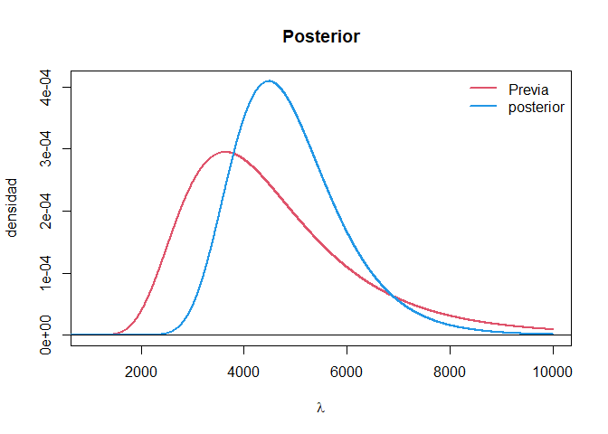

    ## Warning: package 'knitr' was built under R version 4.1.3

    ## Warning: package 'RColorBrewer' was built under R version 4.1.3

## Caso de estudio

Un investigador del Departamento de Ingeniería Electrónica y Eléctrica
de una universidad necesita analizar unos datos sobre los tiempos de
falla de un determinado tipo de alambre (Tipo 1). En este problema, el
tiempo de falla se define como el número de veces que una máquina podría
tensionar el alambre antes de romperse. Los siguientes datos
corresponden a $ n= 14$ tiempos de falla de una parte del experimento:
495  541  1461  1555  1603  2201  2750  3468  3516  4319  6622  7728  13159  21194
A partir de este contexto, Su incertidumbre acerca de estos datos antes
de que fueran observados es intercambiable. Por lo tanto, resulta
apropiado modelar los datos como condicionalmente independientes e
idénticamente distribuidos. El modelo más simple para los datos del
tiempo de falla involucra la distribución Exponencial:

## Pregunta 1

Muestre que $s=\\sum\_{i=1}^n y_i$ es un estadístico suficiente para
*λ*.

### Solucion:

Aplicando el criterio de factorizacion de Fisher-Neyman tenemos que:
$$
\\begin{split}
L(\\lambda\|y_1,...,y_n)&=\\prod\_{i=1}^{n}\\frac{1}{\\lambda}e^{-\\frac{y_i}{\\lambda}}I\_{(0,\\infty)}(y_i)\\\\
&=\\underbrace{\\frac{1}{\\lambda^n}e^{-\\frac{\\sum\_{i=1}^ny_i}{\\lambda}}}\_{g(T(y),\\lambda)}\\overbrace{\\prod\_{i=1}^{n}I\_{(0,\\infty)}(y_i)}^{h(y)} \\\\
\\end{split}
$$
Con esto, vemos que un estadistico suficiente es $s=\\sum\_{i=1}^ny_i$
dado que este estadistico cumple al poder factorizar de la expresion de
verosimilitud en una funcion g que solo depende del estadistico
suficiente y el parametro.

## Pregunta 2

Se dice que la variable aleatoria *X* tiene distribución Gamma-Inversa
con parámetros *α* \> 0 y *β* \> 0, si la función de densidad de *X*
está dada por:
$$
    X \\sim \\textsf{GI} ( \\alpha, \\beta )\\text{,} \\ \\ \\ \\textrm{i.e.,} \\ \\ \\ 
    p ( x ) = \\frac{ \\beta^\\alpha }{ \\Gamma ( \\alpha ) } x^{ - ( \\alpha + 1 ) } \\exp{ \\left( - \\frac{ \\beta }{ x } \\right) } \\quad\\text{para $x>0$}.
    $$
Muestre que si *X* ∼ Gamma(*α*,*β*), entonces
$\\frac{1}{X}\\sim \\textsf{GI} ( \\alpha, \\beta )$.

### Solucion:

Siendo *X* una V.a absolutamente continua, empleamos el teorema de la
transformacion para determinar la distribucion de
$Y=\\frac{1}{X} \\ con \\ X>0$ a partir de la distribucion conocida *X*
asi
$$
P\\left( \\frac{1}{X}\\right) =f_X\\left( \\frac{1}{Y}\\right) \\left\| \\frac{\\delta X}{\\delta Y} \\right\|= \\frac{\\beta^{\\alpha}}{\\Gamma(\\alpha)}\\left(\\frac{1}{Y} \\right)^{\\alpha -1}exp\\left( -\\frac{\\beta}{Y} \\right) \\left\| -\\frac{1}{Y^2} \\right\|
$$
Resolvemos esa expresion como se indica a continuacion
$$
\\begin{split}
P\\left( \\frac{1}{X}\\right) &=\\frac{\\beta^{\\alpha}}{\\Gamma(\\alpha)}\\left(\\frac{1}{Y} \\right)^{\\alpha -1}exp\\left( -\\frac{\\beta}{Y} \\right) \\left( \\frac{1}{Y^2} \\right)\\\\
&=\\frac{\\beta^{\\alpha}}{\\Gamma(\\alpha)}\\left(\\frac{1}{Y} \\right)^{\\alpha +1}exp\\left( -\\frac{\\beta}{Y} \\right) \\\\
P\\left( \\frac{1}{X}\\right)=P\\left( Y \\right)&=\\frac{\\beta^{\\alpha}}{\\Gamma(\\alpha)}Y^{-(\\alpha +1)}exp\\left( -\\frac{\\beta}{Y} \\right) \\sim GI(\\alpha,\\beta)
\\end{split}
$$
Dado que lo optenido al aplicar el teorema de transformacion fue la
distribucion descrita como Gamma inversa (*G**I*) con los respectivos
parametros, podemos asegurar que la afirmacion propuesta en el punto
resulta verdadera.

## Punto 3

Considere la distribución previa *λ* ∼ GI(*α*,*β*) junto con la
distribución muestral . Halle la distribución posterior de *λ*.

### Solucion:

Para esto aplicamos el teorema de bayes para encontrar la distribucion
posterior de *λ* a partir de la distribucion muestral y la distribucion
previa, de la siguiente manera

$$
\\begin{split}
p(\\lambda \| \\vec{y}) &\\propto p(\\vec{y}\|\\lambda)p(\\lambda)\\\\
&\\propto \\left\[ \\prod\_{i=1}^n \\frac{1}{\\lambda}exp \\left( \\frac{-y_i}{\\lambda} \\right) \\right\] \\frac{\\beta^\\alpha}{\\Gamma(\\alpha)}\\lambda^{-(\\alpha+1)}exp\\left( -\\frac{\\beta}{\\lambda} \\right)\\\\
&\\propto \\lambda^{-n}exp\\left( \\frac{-1}{\\lambda}\\sum\_{i=1}^ny_i \\right)\\lambda^{-(\\alpha+1)}exp\\left( \\frac{-\\beta}{\\lambda} \\right)\\\\
p(\\lambda\|\\vec{y})&\\propto \\lambda^{-(\\alpha +n +1)}exp\\left( \\frac{-(\\beta + s)}{\\lambda} \\right) \\sim GI(\\alpha +n,\\beta+s)
\\end{split}
$$

Asi obtenemos la distribucion posterior (que resulto ser un modelo
conjugado ya que la previa y posterior terminaron teniendo la misma
distribucion pero con parametros distintos).

## Punto 4

Se tiene información externa de otro experimento de acuerdo con el cual
la distribución previa de *λ* debería tener una media
*μ*<sub>0</sub> = 4500 y una desviación estándar *σ*<sub>0</sub> = 1800.
Haga un gráfico de las distribuciones previa y posterior en el mismo
gráfico.

### Solucion:

Lo primero es, encontrar *α* y *β* de la distribucion previa tal que
satisfaga la media *μ*<sub>0</sub> = 4500 y la desviacion estandar
*σ*<sub>0</sub> = 1800, dando el siguiente sistema de ecuaciones:
$$
\\begin{split}
4500&=\\frac{\\beta_0}{\\alpha_0-1}\\ \\ \\ \\ \\ \\ \\ para \\ \\alpha_0 >1\\\\
1800&=\\sqrt{\\frac{\\beta_0^2}{(\\alpha_0-1)^2(\\alpha_0-2)}} \\ \\ \\ \\ \\ \\ \\ para \\ \\alpha_0\>2
\\end{split}
$$

Resolviendo el sistema de ecuaciones, tenemos que *α*<sub>0</sub> = 8.25
y *β*<sub>0</sub> = 32625. con esto ya se puede construir la
distribucion previa.

Ahora, en base al punto anterior donde encontramos la distribucion
posterior para este modelo presentado sigue la forma
*G**I*(*α*+*n*,*β*+*s*) donde *n* es el tamaño de la muestra y *s* es la
suma de todos los *y*<sub>*i*</sub>. Para esto tenemos el siguiente
codigo

``` r
data<-c(495,541,1461,1555,1603,2201,2750,3468,3516,4319,6622,7728,13159,21194)
s<-sum(data)
s
```

    ## [1] 70612

``` r
n<-length(data)
n
```

    ## [1] 14

Ahora sigue construir y plotear ambas distribuciones, tanto la previa
como la posterior, con el codigo a continuacion la construimos y
ploteamos

``` r
library(invgamma)
 set.seed(1234)

lambda <- seq(0.005, 10000, length = 10000)
plot(NA, NA, xlim = c(1000,10000),ylim = c(0,0.0004091411),

xlab = expression(lambda), ylab = "densidad", main = "Posterior")
lines(lambda, dinvgamma(lambda,8.25 , 33625), col = 2, lwd = 2)
lines(lambda, dinvgamma(lambda,8.25 + n,  33625 +s ), col = 4, lwd = 2)
abline(h = 0, col = 1)
legend("topright", legend = c( "Previa" , "posterior"), bty = "n", lwd = 2, col = c(2, 4))
```



## Punto 5

Halle el estimador de máxima verosimilitud (MLE, por sus siglas en
inglés) de *λ*.

### Solucion:

Para encontrar el estimador de maxima verosimilitud, lo primero es
calcular la funcion de verosimilitud del parametro dada la muestra y a
dicha funcion le encontramos el maximo global, pero antes, usaremos la
parametrizacion de la exponencial donde $\\theta=\\frac{1}{\\lambda}$,
luego de encontrar el MLE para dicho parametro, aplicamos la invarianza
funcional del estimador MLE para encontrar el estimador MLE de *λ*.

Como lo dijimos anteriormente, empezamos encontrando el MLE de el
parametro *θ* de la siguiente manera $$

$$ ## Github Markdown

To get github friendly Markdown document for cleanly tracking changes to
document in Github, put the following output first:

    output:
      md_document:
        variant: "markdown_github"

NOTE: You need to run this **LAST** though, since knitting other formats
wipes out the `test_files` directory. To return to the Knit button
having other options (HTML, PDF, Word), move this output type below the
first option.

## References

\<!– placeholder for References in toc –!>
